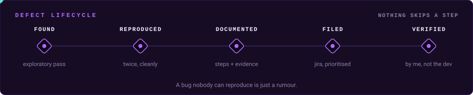
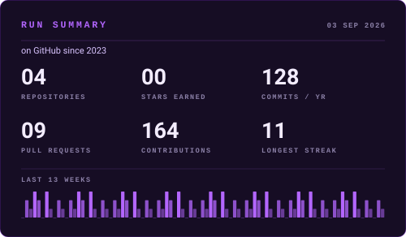
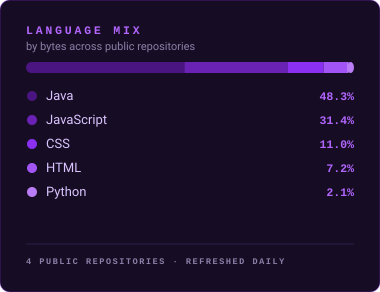

<p align="center">
  <a href="https://rashmigamage.com/">
    
  </a>
</p>

<p align="center">
  <a href="https://rashmigamage.com/"></a>
  <!-- simple-icons dropped the LinkedIn mark, so the glyph is inlined as a data URI to guarantee it renders -->
  <a href="https://www.linkedin.com/in/rashmigamage/"></a>
  <a href="mailto:rashmiupamalika2000@gmail.com"></a>
  
  
</p>

---

### `01` &nbsp; whoami

```js
describe('Rashmi Gamage', () => {

  it('sits between what a feature promises and what it actually does', () => {
    expect(requirement).toEqual(behaviour);   // and writes it up when it does not
  });

  it('works as Associate QA Engineer at Convergence Lanka', () => {
    expect(career.path).toEqual(['trainee', 'associate']);   // no steps skipped
  });

  it('tested LoRa radios in a forest before they earned a pass', () => {
    expect(fieldConditions).not.toBe(deskAssumptions);
  });

  it('leaves reproduction steps a stranger can follow', async () => {
    await handover(defect);
    expect(developer.questions).toHaveLength(0);
  });

});

// PASS  4 passed, 0 failed, 0 skipped
```

- Currently sharpening **Playwright**, **CI/CD pipelines** and **performance testing with JMeter**
- Ask me about test design, defect triage, API verification, or getting hardware to behave outdoors
- Reading a requirement document is the cheapest test you will ever run
- Fun fact: **Mariner 1** was lost in 1962 over a single missing overbar in a handwritten formula. One review would have caught it

---

### `02` &nbsp; coverage



---

### `03` &nbsp; toolbelt

**Testing and automation**

<p>
  
  
  
  
  
</p>

**Languages**

<p>
  
  
  
  
</p>

**Data and version control**

<p>
  
  
  
  
</p>

**Where testing stops being a browser tab**

<p>
  
  
  
  
  
</p>

---

### `04` &nbsp; how a defect leaves my desk



A CV cannot show you the actual writing, so here is the shape of a real report:

| Field | Value |
| :-- | :-- |
| **ID** | `QA-1042` |
| **Title** | Cart total drops the promo code after the delivery address changes |
| **Severity** | High |
| **Priority** | P1, blocks checkout for every returning customer |
| **Environment** | Staging build `2.14.0`, Chrome 141, Windows 11 |
| **Steps** | 1. Sign in as a returning customer<br>2. Add any two items to the cart<br>3. Apply promo code `SAVE10`, confirm the total drops<br>4. Change the delivery address to a different district<br>5. Look at the cart total |
| **Expected** | The discount stays applied, or the user is told plainly that it no longer qualifies |
| **Actual** | The discount silently disappears. The code still shows as applied in the summary panel |
| **Evidence** | Screen recording, HAR file, and the `POST /cart/recalculate` response attached |
| **Notes** | Reproduced twice on a clean session. Not reproducible when the address is changed before the code is applied, which points at the recalculate order |

No adjectives, no blame, and nothing that needs a follow up conversation before a developer can start work.

---

### `05` &nbsp; test suites

<details>
<summary><b>&nbsp;Experience&nbsp;</b><sub>&nbsp; 3 roles, 2 organisations</sub></summary>
<br>

**Associate QA Engineer** &nbsp; `Apr 2026 to present`
Convergence Lanka (Pvt) Ltd, Kumaragewatta, Battaramulla
> Designed and executed manual and automated test cases for web applications, kept test artifacts under Git, built Playwright automation in JavaScript to speed up regression, verified APIs with Postman and backend data with MySQL queries, and tracked defects through to closure in Jira.

**Trainee QA Engineer** &nbsp; `Oct 2025 to Mar 2026`
Convergence Lanka (Pvt) Ltd, Kumaragewatta, Battaramulla
> Wrote and ran manual test cases across web and mobile, picked up Selenium WebDriver and the team automation setup, ran functional, regression and integration cycles, and contributed to test planning and documentation. Converted into the associate role.

**Quality Assurance Engineer Intern** &nbsp; `Mar 2024 to Sep 2024`
Ministry of Agriculture, Battaramulla
> Built test cases for web and mobile systems, ran manual, API, volume and stress testing with Postman and JMeter, wrote JMeter scripts for performance and load scenarios, analysed requirements into test scenarios, and kept QA documentation organised for whoever came next.

</details>

<details>
<summary><b>&nbsp;Education&nbsp;</b><sub>&nbsp; SLIIT, BSc (Hons) IT</sub></summary>
<br>

| Years | Qualification | Institution |
| :-- | :-- | :-- |
| `2021 to 2024` | BSc (Hons) in Information Technology, specialising in Information Technology | Sri Lanka Institute of Information Technology, Malabe |
| `2019` | G.C.E. Advanced Level, Physical Science stream | Sanghamitta Balika Vidyalaya, Galle |

</details>

<details>
<summary><b>&nbsp;Research&nbsp;</b><sub>&nbsp; published in IEEE Xplore</sub></summary>
<br>

**FireWatch: wildfire detection and alert system** &nbsp; `2023 to 2024`

An AI assisted system for early wildfire detection and response, built by a team of four. My side was the IoT layer: real time weather monitoring and emergency communication for forested areas using **LoRa** and **Arduino**, plus the QA work that proved it, validating detection reliability and the fire spread prediction models under conditions that do not cooperate.

Presented at the International Conference on Advances in Computing and Technology, paper published in **IEEE Xplore**.

`ESP32` &nbsp;`LoRa` &nbsp;`Arduino` &nbsp;`Field testing` &nbsp;`Reliability testing`

<br>

**TrackMate: IoT wearable for rehabilitation monitoring** &nbsp; `2024`

A wearable that tracks patients with walking disabilities. Pedometer and fall detection built on MPU9250 sensors and an ESP32 C3 at 95% accuracy, real time alerts over Firebase and MQTT, and quantised LSTM models in TensorFlow Lite recognising walking patterns at 96% on device. I ran the data validation and on device performance testing that confirmed recognition held up as conditions changed.

`ESP32` &nbsp;`TensorFlow Lite` &nbsp;`MQTT` &nbsp;`Firebase` &nbsp;`Edge inference`

</details>

---

### `06` &nbsp; things I built, then tried to break

| Repository | What it is | Stack | My part |
| :-- | :-- | :-- | :-- |
| **[Aqua&#8209;Assist](https://github.com/RashmiGamage00/AquaAssistDonationPlatform)** | People report water sanitation problems in their area and back campaigns to clean up water sources | `MongoDB` `Express` `React` `Node` | Built features and ran the manual passes over the reporting and donation flows |
| **[FlavourFeed](https://github.com/RashmiGamage00/FlavourFeedSocialMediaPlatformForFoodies)** | A social platform for people who take their food seriously: post a dish, review it, argue in the comments | `Spring Boot` `React` `MongoDB` | Post management module, then tested create, edit and delete until the edge cases stopped surprising me |
| **[The Hotel](https://github.com/RashmiGamage00/TheHotelMobileApp)** | Android app for booking halls and rooms for events and meetings | `Java` `Firebase` | Ratings and feedback feature with full CRUD, verified through Postman and Selenium |
| **[Supermarket System](https://github.com/RashmiGamage00/SuperMarketManagementSystem)** | Account management for an online supermarket: registration, profiles, roles, and the quiet failure paths nobody demos | `Selenium` | Where Selenium stopped being a lecture slide and caught a real regression |

---

### `07` &nbsp; the numbers

> These two cards are **drawn by this repository**, not fetched from a widget host. A GitHub Action pulls the figures from the GitHub API every morning and commits the SVGs. See [`scripts/build_stats.py`](scripts/build_stats.py). The popular alternatives were all returning 503 or "payment required" when this profile was built, which is why so many READMEs show broken images.

<p align="center">
  
  
</p>

<p align="center">
  
</p>

<p align="center">
  
</p>

---

### `08` &nbsp; teardown

<p align="center">
  <b>Got something that needs testing?</b><br>
  Tell me what it does and what it is supposed to do.<br>
  I will come back with what I would test first, and why.
</p>

<p align="center">
  <a href="mailto:rashmiupamalika2000@gmail.com"></a>
  <a href="https://rashmigamage.com/"></a>
</p>


